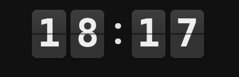
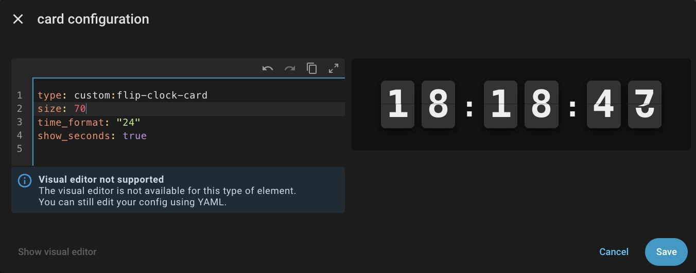

# Flip Clock Card 


Yo! Here is a neat little card I whipped up for Home Assistant. It's a retro style Flip Clock (split flap display) that actually animates properly.



I wasn't happy with the static clocks out there, so I made this one. It has a real 3D fall down animation with a satisfying little bounce at the end. Looks super clean on wall mounted tablets.

## Why you might want this

* **It moves!** The cards actually flip down. It's weirdly satisfying to watch.
* **No bloat.** It's just pure CSS and JS. No heavy libraries attached.
* **Customizable.** Make it huge, make it tiny  your call.
* **12h / 24h.** Whether you like AM/PM or military time, I got you covered.
* **Seconds.** You can show them if you want to see time fly by.
* **World Timezones.** Display time in any timezone - from Tokyo to New York, with 100+ cities!
* **Themed.** Comes with built-in styles like Star Trek, Apple style, neon, and a few nerdy ones.

---

## How to install

### The Easy Way (HACS)

1. Go to **HACS → Frontend**.
2. Click the 3 dots (top right) → **Custom repositories**.
3. Paste the URL of this repo.
4. Choose **Dasboard** as the category.
5. Click **Add**, then install. Done.

### The "I like pain" Way (Manual)

1. Download the `flip-clock-card.js` file from the releases.
2. Drop it into your `/config/www/` folder.
3. Add it to your dashboard resources:

   ```yaml
   url: /local/flip-clock-card.js
   type: module
   ```

4. Hard refresh your browser (Ctrl+F5 / Cmd+Shift+R), or bump the URL with `?v=2`.

---

## How to use it 🛠️

### Visual Editor 
The card fully supports the Lovelace Visual Editor. You can configure most options (theme, size, seconds, format) directly in the UI without touching YAML.

### YAML Configuration
Setting this up is straightforward. YAML mode, one card, done.

### 1. Basic setup (quick start)

```yaml
type: custom:flip-clock-card
size: 80                # Card size in px (height of one tile). Default: 100
time_format: '24'       # '12' for AM/PM, '24' for 24h
show_seconds: true      # false to hide seconds
```

---

### 2. Timezone Selector 🌍

Display time in any timezone in the world! Choose from over 100 major cities and regions, each with multiple label variants.

```yaml
timezone:
  value: 'America/New_York'   # IANA timezone identifier
  label: 'NYC'                # Label to display (optional)
show_label: true               # Show/hide the timezone label
label_position: 'right'        # Position: right, left, top, bottom, right-vertical
```

#### Timezone Options

The timezone can be specified in two formats:

**Simple format (no label):**
```yaml
timezone: 'America/New_York'
```

**Advanced format (with custom label):**
```yaml
timezone:
  value: 'America/New_York'
  label: 'NYC'
```

Each timezone has multiple label variants to choose from in the visual editor:
- **UTC**: UTC, UTC (Z), GMT, GMT+0, ZULU
- **New York**: New York, NYC, EST/EDT, Eastern Time
- **London**: London, UK, GMT/BST
- **Warsaw**: Warsaw, Warszawa, Poland, Polska, CET/CEST
- **Tokyo**: Tokyo, Japan, JST, Tokyo (GMT+9)
- ... and many more!

#### Label Display Options

Control label visibility and positioning:

```yaml
show_label: true                # Show the timezone label (default: false)
label_position: 'right'         # Position of the label
```

**Label Positions:**
- `right` (default) - Horizontal label on the right side
- `left` - Horizontal label on the left side
- `top` - Label above the clock
- `bottom` - Label below the clock
- `right-vertical` - Vertical label on the right side

**Example: UTC with vertical "Z" label**

```yaml
type: custom:flip-clock-card
timezone:
  value: 'UTC'
  label: 'Z'
show_label: true
label_position: 'right-vertical'
show_seconds: true
theme: aviator
size: 120
```

**Example: Tokyo with label on top**

```yaml
type: custom:flip-clock-card
timezone:
  value: 'Asia/Tokyo'
  label: 'JST'
show_label: true
label_position: 'top'
theme: neon
size: 100
```

**Example: Multiple Timezones with different labels**

```yaml
type: grid
columns: 3
cards:
  - type: custom:flip-clock-card
    timezone:
      value: 'Europe/Warsaw'
      label: 'Polska'
    show_label: true
    label_position: 'bottom'
    theme: classic
    size: 80
  - type: custom:flip-clock-card
    timezone:
      value: 'America/New_York'
      label: 'EST/EDT'
    show_label: true
    label_position: 'right'
    theme: ios-dark
    size: 80
  - type: custom:flip-clock-card
    timezone:
      value: 'Asia/Tokyo'
      label: 'JST'
    show_label: true
    label_position: 'left'
    theme: neon
    size: 80
```

**Visual Editor**: The timezone selector in the visual editor includes all timezones organized by region, with multiple label variants for each timezone!

---

### 3. Animation speed

You can control how fast the flip animation runs.

```yaml
animation_speed: 0.6
```

- Value is in **seconds** for the full flip cycle (top drop + bottom rise).
- Internally the card splits that into two halves (top phase + bottom phase).
- Reasonable range:
  - `0.3` – fast, snappy flip
  - `0.6` – default, with a nice little bounce
  - `0.8–1.0` – slower, more “mechanical”

**Example: slower, more dramatic flip**

```yaml
type: custom:flip-clock-card
size: 120
time_format: '24'
show_seconds: true
animation_speed: 0.8
```

---

### 4. Themes (built-in styles)

The card comes with several built-in themes that change colors, fonts, shadows and overall vibe.

You set them with:

```yaml
theme: classic   # or ios-dark, neon, borg, ...
```

Available themes:

- `classic` – dark panel, light text, default retro look
- `ios-light` – bright, clean, iOS-like
- `ios-dark` – dark Apple-style clock, subtle and soft
- `neon` – black background, neon green glow
- `red-stealth` – dark + red digits, stealth HUD kind of feel
- `synthwave` – purple / magenta, loud and fun
- `e-ink` – light background, dark text, paper-ish look
- `terminal` – green monospace on black, classic terminal
- `wood` – brown, warm, retro wall clock vibes
- `trek-orange` / `trek-red` / `trek-blue` – bold colors inspired by Star Trek LCARS-style panels
- `borg` – black, green, harsh glow, very “resistance is futile”
- `aviator` – **NEW!** Airport departure board style with Oswald font (Grafana style)

### 🧩 Preview Dashboard

Want to see all themes and configurations in action? 
Copy the contents of **[lovelace_examples.yaml](lovelace_examples.yaml)** into a new Dashboard (Raw configuration editor) to get a full gallery of every style and option available.

**Example: iOS-style dark**

```yaml
type: custom:flip-clock-card
size: 130
time_format: '24'
show_seconds: true
theme: ios-dark
animation_speed: 0.5
```

**Example: neon terminal flip**

```yaml
type: custom:flip-clock-card
size: 110
time_format: '24'
show_seconds: true
theme: neon
animation_speed: 0.4
```

**Example: full nerd – Borg**

```yaml
type: custom:flip-clock-card
size: 120
time_format: '24'
show_seconds: true
theme: borg
animation_speed: 0.5
```

---

### 5. Custom theme (override built-in styles)

If the built-in themes aren’t enough, you can take any `theme` as a base and override some or all of its values with `custom_style`.

Available fields inside `custom_style`:

- `bg` – tile background color
- `text` – digit color
- `font` – font-family
- `radius` – border radius (relative, e.g. `0.1` = 10% of tile height)
- `shadow` – box-shadow
- `line` – color of the split line between top and bottom halves
- `glow` – text-shadow used as glow for the digits

**Example: custom yellow glow on top of classic**

```yaml
type: custom:flip-clock-card
size: 120
time_format: '24'
show_seconds: true
theme: classic
animation_speed: 0.55
custom_style:
  bg: "#101010"
  text: "#ffcc00"
  glow: "0 0 12px rgba(255, 204, 0, 0.8)"
```

**Example: softer e-ink style**

```yaml
type: custom:flip-clock-card
size: 100
time_format: '24'
show_seconds: false
theme: e-ink
custom_style:
  bg: "#fdf7e3"
  text: "#222222"
  font: "'Georgia', serif"
```

---

### 6. Full example (wall tablet)

```yaml
type: custom:flip-clock-card
size: 160
time_format: '24'
show_seconds: true
animation_speed: 0.6
theme: ios-dark
```

Or something more aggressive:

```yaml
type: custom:flip-clock-card
size: 140
time_format: '24'
show_seconds: true
animation_speed: 0.4
theme: synthwave
```

---

That's it. Drop it on a dashboard, pick a theme, tweak the animation speed and you've got a flip clock that looks like it belongs on an airport board, a starship bridge, or your hallway tablet.

---

## Security & Validation

The card includes built-in input validation and sanitization to prevent CSS injection attacks and ensure safe operation.

### Input Validation

All user inputs are validated and sanitized:

- **`size`**: Must be a number between 10 and 500 pixels (default: 100)
- **`animation_speed`**: Must be a number between 0.1 and 2.0 seconds (default: 0.6)
- **`time_format`**: Only accepts `'12'` or `'24'` (default: `'24'`)
- **`show_seconds`**: Boolean value (default: `false`)
- **`timezone`**: IANA timezone identifier or object with value and label (default: `null` for local time)
- **`show_label`**: Boolean value (default: `false`)
- **`label_position`**: Must be one of: `'right'`, `'left'`, `'top'`, `'bottom'`, `'right-vertical'` (default: `'right'`)
- **`theme`**: Must be one of the predefined theme names (default: `'classic'`)
- **`custom_style`**: All CSS values are sanitized:
  - Colors are validated against CSS color formats (hex, rgb, rgba, hsl, named colors)
  - Font families are sanitized to prevent injection
  - CSS values are escaped to prevent XSS attacks

### Safe Defaults

If any invalid input is provided, the card falls back to safe default values. Invalid custom styles are ignored, and the base theme is used instead.

### Security Best Practices

- All CSS values are sanitized before being inserted into the DOM
- Theme names are validated against a whitelist
- Custom style properties are validated and sanitized individually
- Error handling prevents crashes from malicious or malformed input

---

## Troubleshooting

### Clock not updating

- **Check browser console**: Look for any error messages
- **Verify configuration**: Ensure all required parameters are correctly formatted
- **Clear browser cache**: Hard refresh (Ctrl+F5 / Cmd+Shift+R) or add `?v=X` to the resource URL
- **Check visibility**: The clock stops when not visible (uses IntersectionObserver for performance)

### Theme not applying

- **Verify theme name**: Check spelling - theme names are case-sensitive
- **Check custom_style**: Invalid custom style values are ignored - verify color formats and font names
- **Fallback behavior**: Invalid themes default to `'classic'`

### Animation issues

- **Animation speed**: Values outside 0.1-2.0 range are clamped to valid range
- **Performance**: On slower devices, try reducing `animation_speed` or `size`
- **Browser support**: Requires modern browser with CSS animations support

### Configuration errors

- **Invalid values**: All invalid inputs fall back to safe defaults
- **Type errors**: Numbers are parsed and validated - strings are converted where appropriate
- **Missing properties**: Optional properties use sensible defaults

### Performance tips

- **Large sizes**: Very large `size` values (>300px) may impact performance
- **Multiple instances**: Running many clock cards simultaneously may slow down the dashboard
- **Browser optimization**: The card uses IntersectionObserver to stop when not visible

If it acts weird: check your browser cache and make sure the `theme` name is spelled correctly before blaming the card 😉
